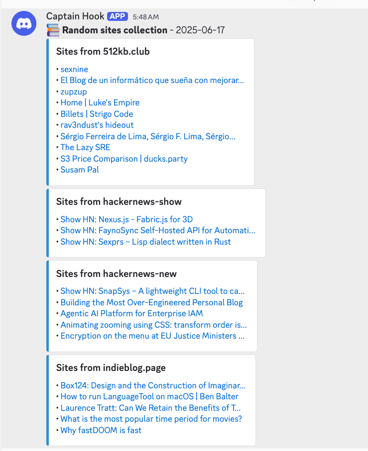
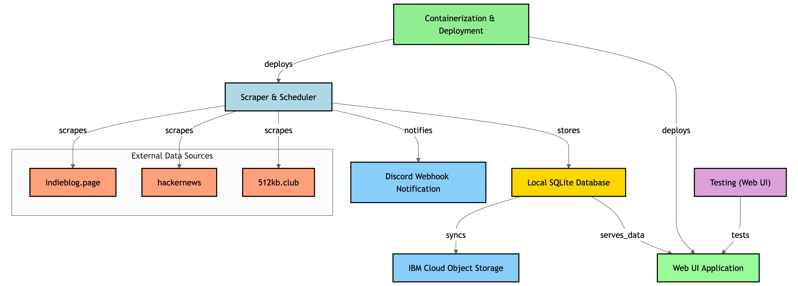

# kylfusköfu (Icelandic for "club scraper")

## Overview

This application collects random websites from multiple sources and stores them in a SQLite database with intelligent content filtering. The tool focuses on discovering English-language content from the small web and indie blog communities, then syncs the database with IBM Cloud Object Storage and sends notifications via Discord webhook.



---

## Features

### 🌐 Multi-Source Web Discovery
- **512KB Club Sites**: Discovers and filters English-language websites from the small web community
- **Hacker News**: Collects stories from both "Show HN" and "New" sections
- **IndieWeb Blogs**: Curates random posts from independent bloggers
- **Smart Deduplication**: Prevents collecting the same URLs multiple times

### 🤖 Intelligent Content Filtering
- **English Detection**: Automatically identifies English-language 512KB Club sites using multiple detection methods:
  - HTML `lang` attribute analysis
  - Title and navigation text analysis
  - Content sampling for English word patterns
  - Smart fallback mechanisms
- **Quality Control**: Filters out non-English sites to improve content relevance

### 📊 Data Management
- **SQLite Database**: Local storage with enhanced schema for language detection
- **Cloud Sync**: Automatic backup to IBM Cloud Object Storage
- **Markdown Reports**: Generates timestamped markdown files with organized site collections

### 🔔 Notifications
- **Discord Integration**: Sends organized webhooks with clickable links grouped by source

## Why This Tool?

- **Learning Python**: Practical problem-solving approach to language learning
- **Small Web Discovery**: Automated way to find content from 512kb.club and indieblog.page without manual clicking
- **RSS Feed Preparation**: Building towards curated content feeds outside traditional social media
- **Content Aggregation**: Discovering diverse voices and information sources

## Current Status

- [x] Multi-source scraping with intelligent filtering
- [x] English language detection for 512KB Club sites
- [x] Enhanced database schema with language analysis
- [x] Markdown report generation
- [x] Discord webhook notifications
- [x] Cloud database synchronization
- [x] Comprehensive logging and error handling

## Future Plans

- [ ] Anthropic API integration for content summarization
- [ ] RSS feed generation from collected sites
- [ ] Code Engine deployment instructions
- [ ] Additional content sources
- [ ] Web interface for browsing collected sites

## CLI Usage

### Basic Collection
```bash
# Run full collection with cloud sync
python app.py

# Run in local mode (no cloud storage)
python app.py --local
```

### Analysis & Reports
```bash
# Analyze existing 512KB sites for English language
python app.py --analyze-english

# Generate markdown report from existing database
python app.py --generate-markdown
```

## Testing Locally

### Prerequisites

- Python 3.12+
- Discord webhook URL (for notifications)

### Setup

1. Clone the repository

```bash
git clone https://github.com/greyhoundforty/kylfuskofu
cd kylfuskofu
```

2. Create a virtual environment

```bash
python3 -m venv venv
source venv/bin/activate
```

3. Install the dependencies

```bash
pip install -r requirements.txt
playwright install chromium
```

4. Set up environment variables:

```bash
export DISCORD_WEBHOOK_URL=<your-discord-webhook-url>
```

5. Run the application using a local SQLite database

```bash
python app.py --local
```

## Production Setup with Remote Database

To persist data across runs and deployments, configure IBM Cloud Object Storage for database synchronization.

### Prerequisites

- IBM Cloud Object Storage instance with a dedicated bucket

### Environment Variables

```bash
export COS_ENDPOINT=<your-cos-endpoint>
export COS_API_KEY=<your-cos-api-key>
export COS_INSTANCE_CRN=<your-cos-instance-crn>
export COS_BUCKET_NAME=<your-bucket-name>
export DISCORD_WEBHOOK_URL=<your-discord-webhook-url>
```

### Run the application

```bash
python app.py
```

## How It Works



> Code diagram courtesy of the awesome [GitDiagram](https://gitdiagram.com/).

## Development

### Code Quality
The project uses pre-commit hooks for code quality:
- **Black**: Code formatting
- **Pylint**: Code analysis and linting
- **Standard hooks**: Trailing whitespace, YAML validation, merge conflict detection

### Install development dependencies
```bash
pip install -r requirements.txt
pre-commit install
```

### Run code quality checks
```bash
# Run all pre-commit hooks
pre-commit run --all-files

# Run specific checks
black .
pylint app.py utils.py
```

## Output Examples

### Markdown Report Format
```markdown
## 512KB Club Sites

- [Example Personal Site](https://example.com)
- [Developer Portfolio](https://dev.example.com)

## Hacker News - Show HN

- [Show HN: My new project](https://news.ycombinator.com/item?id=123456)

## Hacker News - New Stories

- [Interesting tech article](https://techsite.example.com)

## IndieWeb Blogs

- [Personal blog post](https://blog.example.com/post1)
- [Indie writer thoughts](https://writer.example.com/post2)
```

### Discord Webhook
Organized embeds grouped by source with clickable links and clean formatting.

## Troubleshooting

### Common Issues
- **No 512KB sites in output**: Sites may not be detected as English. Check logs for detection details.
- **Import errors**: Ensure all dependencies are installed and virtual environment is activated.
- **Cloud storage errors**: Verify IBM COS credentials and bucket permissions.

### Debugging
Enable detailed logging by checking the Tamga logger output for step-by-step processing information.
